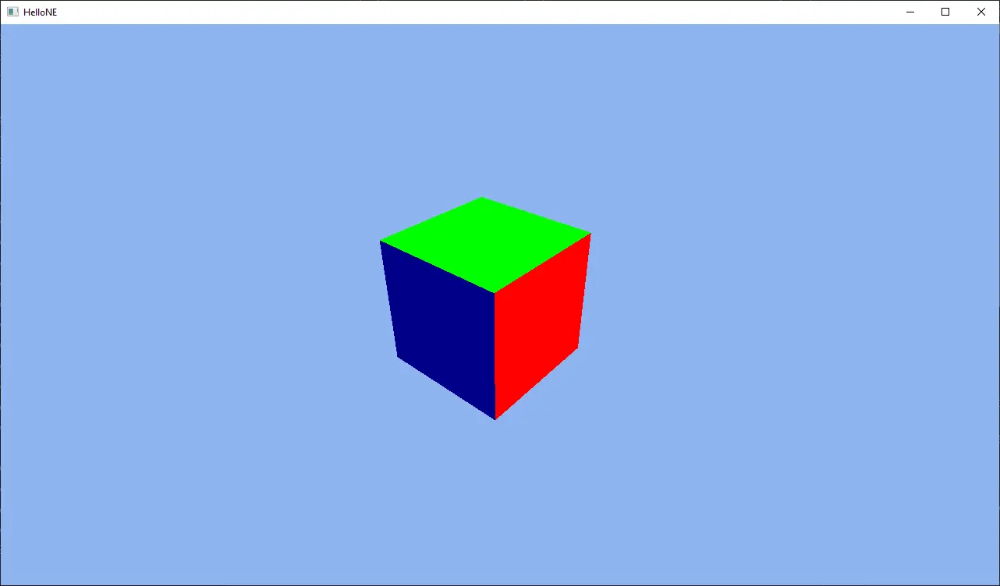
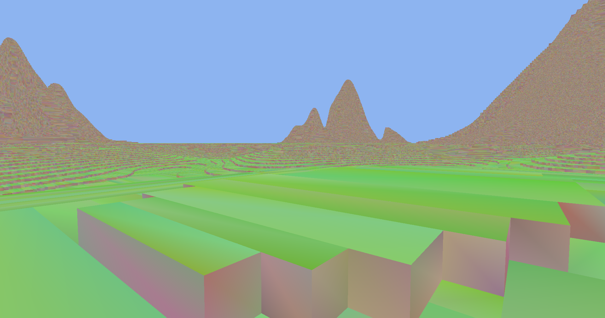

# Docs of NoiseEngine
Welcome to NoiseEngine docs!

## Sections

    <a href="manual/">
        
        <h3>Manual</h3>
    </a>
    
Manual which describes how to use NoiseEngine

    <a href="internal/">
        
        <h3>Internal</h3>
    </a>
    
NoiseEnginet's architecture description

